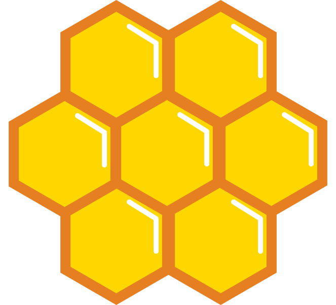
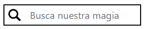
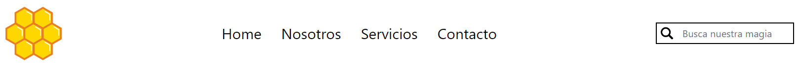
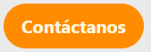
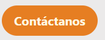
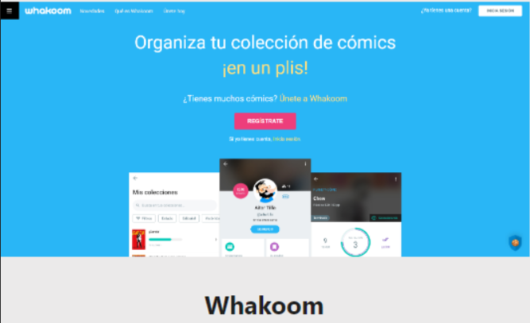

# Diseño del proyecto Hive Mind

## Descripción

Para este proyecto nos hemos centrado en el diseño y desarrollo de una página web de una empresa agencia de marketing cuyo foco de actividad son varias como la realización de spots televisivos, videoclips de grupos musicales, campañas publicitarias y un largo devenir de futuros proyectos.

## Tecnologías que usaremos

- **Figma:** Para el diseño inicial, así como definición de variables que usaremos posteriormente en nuestro código.
- **Vite:** Como herramienta de desarrollo para crear un entorno rápido y eficiente.  
- **React:** Para la construcción de la interfaz de usuario basada en componentes reutilizables.  
- **TypeScript:** Para agregar tipado estático y mejorar la mantenibilidad del código.  
- **Tailwind CSS:** Para el diseño y estilización con clases utilitarias, permitiendo una maquetación rápida y responsiva.

## Instalación

### Requisitos antes de comenzar

Básicamente lo único que vamos a necesitar es tener instalado Node.js en nuestro sistema.

### Setup

1. Clona el repositorio
   Abre una terminal y ejecuta el siguiente comando:
   git clone https://github.com/oligarc/HIVE-MIND.git
   Entra con cd HIVE-MIND

2. Instalar dependencias
   Una vez dentro del proyecto ejecuta:
   npm install
   Este comando instalará todas las dependencias que encontramos en nuestro package.json

3. Iniciar el servidor de desarrollo
   Para arrancar la aplicación en modo desarrollo ejecuta:
   npm run dev
   Esto iniciará el servidor de desarrollo de Vite, y podrás acceder a la aplicación en tu navegador en la dirección que se indique en la terminal

## Diseño de componentes

A continuación, os dejamos una primera vista de nuestros componentes antes de que clonéis el repositorio o bajéis el código.

### Logo

### Search Input

### Header

### Botón

### Botón (Hover)

### Customer Card

### Worker Card

### Service Card

### Service Card

Nótese que Whakoom.com no es nuestro proyecto y simplemente lo hemos puesto para referenciar mejor el componente.

### Network Services

### Footer

## Distribución del trabajo

Wafae:
 - Sistema de diseño en Figma.
 - Elección de fuentes y paleta de colores.

Óliver:
 - Diseño de componentes.
 - Exportación de estilos a Tailwind CSS.
 - Implementación de componentes en React.
 - Organización y estructuración del código.
 - Readme.

## Link a Figma

Para visitar nuestro sistema de diseño utilizado en la aplicación Figma, puedes hacerlo presionando en el siguiente [enlace](https://www.figma.com/design/bdIZ0pCiOjnAjmVeC2xeO0/BOCETO-interfaces-hive-mind?node-id=48-2&p=f&t=mzS2Sx5OuNGslpnN-0)

Por favor, sentíos libres a la hora de comentar y darnos feedback. Será de mucha ayuda

## Contacto

- [Oliver LinkedIn](https://www.linkedin.com/in/%C3%B3liver-garc%C3%ADa-rodr%C3%ADguez/)
- [Oliver GitHub](https://github.com/oligarc)

- [Wafae LinkedIn]()
- [Wafae GitHub](https://github.com/wafaes)
